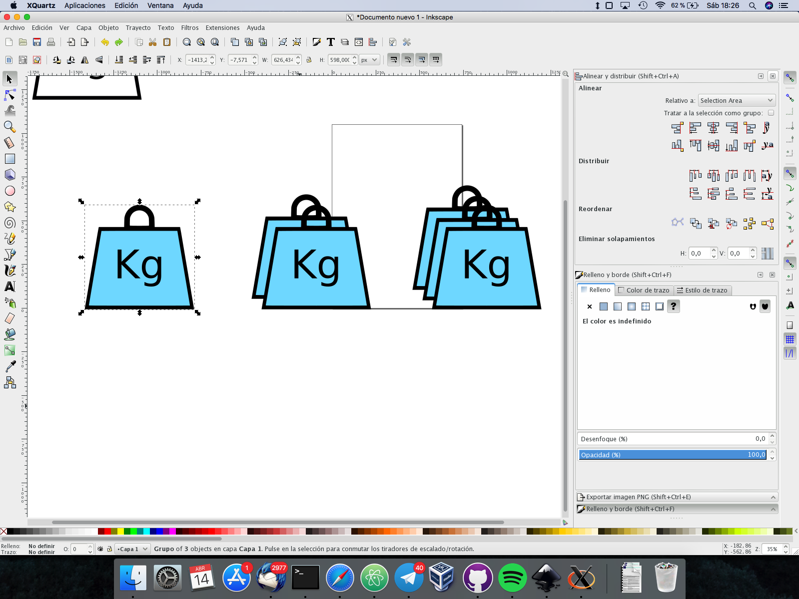

# Práctica 1: HTML5 y CSS3
## Programación Web - UGR
### Rafael Nogales Vaquero

#### 14 de Abril 2018

### Introducción:
Se pretende crear una página web para un gimnasio utilizando unicamente HTML5 y CSS3. Este desarrollo no debe incluir librerías externas como *Boostrap* o *Pure*, así como tampoco debe utilizar JavaScript. Por tanto se debe dar el contenido dinámico únicamente mediante reglas de estilo CSS.  

El sitio web tiene una estructura clásica con un archivo principal index.html desde el que salen los enlaces al resto de páginas.  
Estas otras páginas son:  
<a href="http://betatun.ugr.es/~x76669550/centrodeportivo/actividades.html" class="no-link-style main-menu-item" >Actividades</a>  
<a href="" class="no-link-style main-menu-item">Horario</a>  
<a href="http://betatun.ugr.es/~x76669550/centrodeportivo/tecnicos.html"  class="no-link-style main-menu-item">Técnicos</a>  
<a href="#" class="no-link-style main-menu-item" >Instalaciones y servicios</a>  
<a href="http://betatun.ugr.es/~x76669550/centrodeportivo/localizacion.html" class="no-link-style main-menu-item"   >Localización</a>  
<a href="http://betatun.ugr.es/~x76669550/centrodeportivo/precios.html" class="no-link-style main-menu-item" >Precios y promociones</a>  
<a href="#" class="no-link-style main-menu-item" >Alta de usuarios</a>  
<a href="http://betatun.ugr.es/~x76669550/centrodeportivo/foro.html" class="no-link-style main-menu-item" >Foro</a>  

A continuación describiré brevemente los puntos fuertes de cada página:

### index.html
Es la página princial y consta de un diseño sencillo del tipo:  
*Navbar - Aside - Main - Footer*  
Para crearlo he utilizado la propiedad **display: grid** sobre un contenedor que crea la estructura para después rellenarla sin tener problemas con las alineaciones.  
grid es una nueva propiedad CSS que se ha vuelto estandar este año.  La alternativa habría sido usar flexbox pero me ha gustado el grid.  
No he querido meter ningun contenido mediante CDN's.

Lo más llamativo de la página es el efecto que se consigue cambiando el background-color con un hoover en el menú.

### actividades
Para la versión de escritorio se utiliza un grid igual que en el index pero para la versión movil se cambia el display a block para que vayan apilandose los elementos uno debajo del otro.  
Tambien se elimina el logo del navbar puesto que ocupa mucho espacio si no.  
Tambien cambian los tamaños del texto (para ello he utilizado la unidad de medida **em**)

### Técnicos
Se van disponiendo las cajas de los técnicos en bloques dentro de la misma linea (inline-block) y se les obliga a tener un ancho minimo razonable para que no aparezcan apelotonados.  
Además para darle más vistosidad se les ha modificado la propiedad hoover a las imagenes aplicando una máscara de blanco y negro de modo que al pasar el raton sobre una imágen se pone a color original.  

### Localización
Aquí lo más relevante es que he utilizado un mapa de **OpenStreetMap** en lugar de los de un proveedor privado como podría ser Google Maps.  
Funciona igual que los de google pero no tienes que dar información de tus visitantes y se mejora la privacidad de tu sitio.  Aunque para una empresa real probablemente sea más interesante utilizar Google Maps puesto que es probable que exista una penalización en el SEO por utilizar otros proveedores.  
[Puesto que hay una notable rivalidad entre ambos](https://blog.openstreetmap.org/2012/01/17/google-ip-vandalizing-openstreetmap/)

### Precios y Promociones

Aquí igual que en los otros casos he creado las imágenes por mi mismo:  

Aquí además se han utilizado **flexbox** además de grids para poder colocar los tres bloques centrados.

### Alta de usuario

Un formulario con varios campos, cabe destacar el campo para imagenes y las etiquetas *fieldset* y *legend*.  
Una vez acabado el registro se podría redirigir a una página "success.html" pero por el momento se redirige al index.html

### Foro
Se utiliza un lista del posts para el feed y se crea una cabecera con un botón que en el futuro servirá para crear nuevos hilos conectandolo al backend.  
